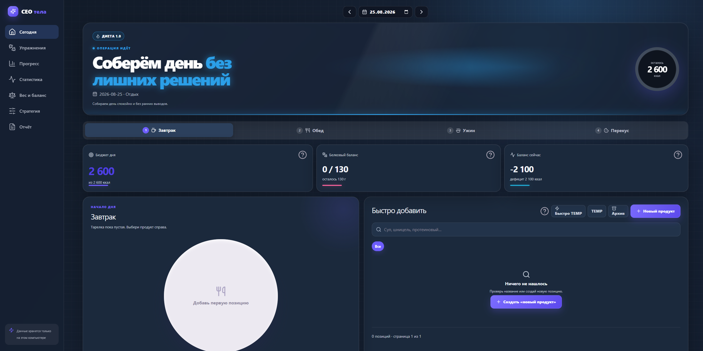
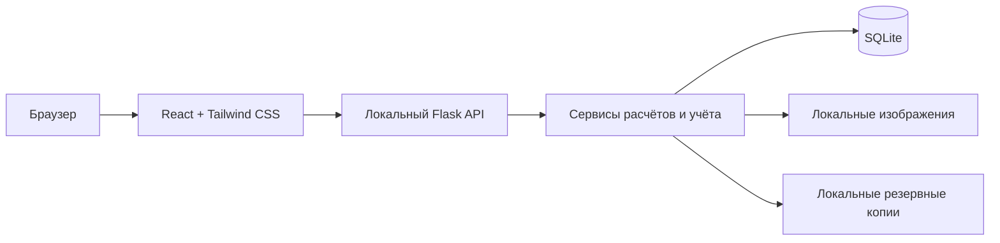
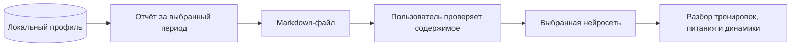
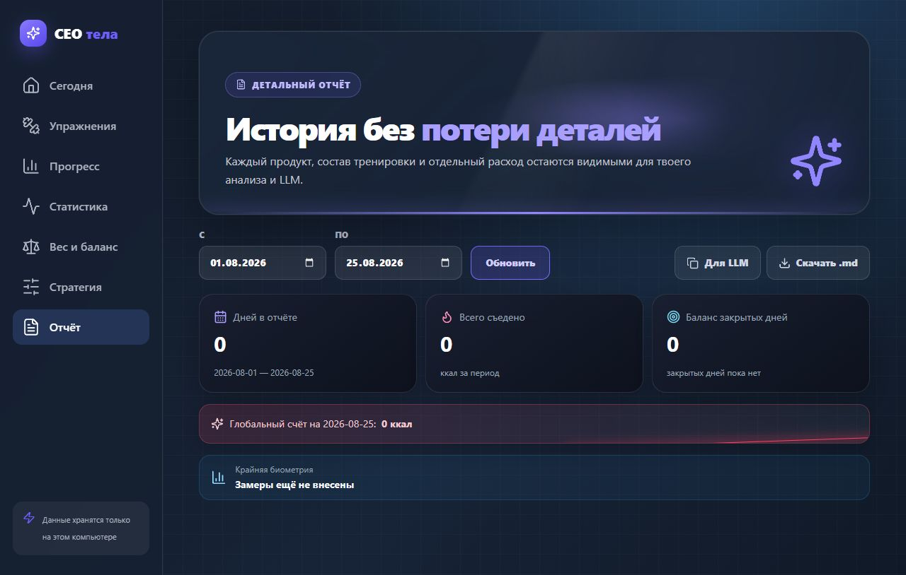

# СЕО тела

<p align="center">
  
  
  
  
  
  
  
</p>

«СЕО тела» — локальное веб-приложение для ведения питания, тренировок, активности, сна, замеров и динамики веса. Оно помогает собрать ежедневные показатели в одном месте, оценивать энергетический баланс и наблюдать изменения на длинной дистанции.

Приложение рассчитано на одного пользователя и работает на его компьютере. Учётные записи, облачный сервер и обязательные внешние сервисы не нужны: интерфейс открывается в браузере, Flask обслуживает API, а данные хранятся в локальной SQLite.



## Содержание

- [Почему появился проект](#почему-появился-проект)
- [Возможности](#возможности)
- [Как устроено приложение](#как-устроено-приложение)
- [Быстрый старт](#быстрый-старт)
- [Первый запуск](#первый-запуск)
- [Где хранятся данные](#где-хранятся-данные)
- [Работа с нейросетями](#работа-с-нейросетями)
- [Разработка](#разработка)
- [Проверки](#проверки)
- [Использование ИИ-агентов при разработке](#использование-ии-агентов-при-разработке)
- [Участие в проекте](#участие-в-проекте)
- [Ограничения](#ограничения)
- [Лицензия](#лицензия)

## Почему появился проект

Изначально я делал «СЕО тела» для себя. Мне хотелось собрать питание, тренировки, активность, сон, замеры и динамику веса в одном понятном инструменте, который хранит данные локально и подстраивается под мой реальный процесс, а не заставляет вести несколько разрозненных таблиц и приложений.

Со временем проект стал для меня действительно удобным рабочим инструментом. Поэтому я решил открыть исходный код: возможно, кому-то пригодится сама идея, готовое приложение или отдельные решения из него. Проект по-прежнему развивается из практического личного использования, но теперь открыт для предложений, исправлений и адаптаций под другие сценарии.

## Возможности

- дневник питания с собственным каталогом продуктов, категориями и временными позициями;
- планирование дня с учётом сна, активности и тренировки;
- каталог упражнений и шаблоны тренировок;
- журнал силовых подходов и кардио;
- замеры тела и история веса;
- статистика, подробные отчёты и анализ тренда веса;
- выгрузка подробного отчёта в Markdown для работы с нейросетями;
- версионируемая стратегия с TDEE, белковым коридором и целевой дельтой;
- локальные резервные копии базы данных;
- загружаемые изображения продуктов и упражнений.

Новая установка запускается с пустым профилем. В репозитории нет готовой базы, пользовательских продуктов, тренировок, замеров или изображений.

## Как устроено приложение



React отвечает за интерфейс, Flask — за локальный API и production-раздачу собранного приложения, SQLite — за персональные данные. Tailwind CSS используется для компонентной вёрстки; единственный глобальный файл `frontend/src/styles/index.css` содержит подключение Tailwind, дизайн-токены, базовые правила браузера и сложные общие анимации.

## Быстрый старт

### Требования

- Windows 10 или 11;
- Python 3.12;
- Node.js 20 или новее;
- npm.

Docker для локального запуска не требуется.

### Установка

```powershell
git clone https://github.com/Sva1pone/CEO_body.git
cd CEO_body
python -m venv .venv
.venv\Scripts\python.exe -m pip install -r requirements.txt
npm ci
npm run build
```

### Запуск

Откройте `Запустить СЕО.bat` двойным щелчком или выполните:

```powershell
.venv\Scripts\python.exe app.py
```

По умолчанию приложение доступно по адресу [http://127.0.0.1:5050](http://127.0.0.1:5050).

Другой порт можно указать явно:

```powershell
.venv\Scripts\python.exe app.py --port 5070
```

Порты `5060` и `5061` намеренно запрещены: браузеры блокируют их как небезопасные служебные SIP-порты.

Для запуска без консольного окна и автоматического открытия браузера:

```powershell
.venv\Scripts\pythonw.exe app.py --headless
```

## Первый запуск

1. Откройте раздел «Стратегия».
2. Укажите название текущей фазы, базовый TDEE, белковый коридор и целевую дельту.
3. При необходимости создайте категории продуктов, продукты, упражнения и шаблоны тренировок.
4. Вернитесь на главную страницу и настройте первый день.

Все персональные значения вводятся через интерфейс и сохраняются в SQLite. Исходный код не содержит пользовательской стратегии или готовой таксономии тренировок.

## Где хранятся данные

- `data/ceo_body.db` — основная SQLite;
- `data/backups/` — локальные резервные копии;
- `static/uploads/` — пользовательские изображения;
- `logs/` и `data/*.log` — runtime-логи.

Эти пути игнорируются Git. Обновление кода через Git не должно заменять или удалять локальную базу и загруженные файлы. Для переноса профиля на другой компьютер скопируйте `data/` и `static/uploads/` отдельно.

Приложение не отправляет содержимое профиля во внешние ИИ-сервисы и не требует подключения к ним во время работы.

## Работа с нейросетями

Проект предназначен в том числе для совместной работы с нейросетями, которые пользователь может привлекать как вспомогательных тренеров, консультантов по питанию или аналитиков прогресса.

В разделе «Отчёт» выбранный период можно скопировать или скачать в формате `.md`. Выгрузка включает показатели дней, рацион, энергетический баланс, сон, замеры, силовые подходы и кардио. Такой файл удобно передать выбранной нейросети вместе со своим вопросом, не открывая ей прямой доступ к приложению или базе данных.

Пользователь сам решает, куда отправлять выгруженный отчёт, и отвечает за содержащиеся в нём персональные сведения. Ответы нейросетей могут содержать ошибки и не заменяют диагностику, лечение или индивидуальные рекомендации врача и других профильных специалистов.





## Разработка

Flask и Vite можно запустить отдельно:

```powershell
.venv\Scripts\pythonw.exe app.py --headless
npm run dev
```

Vite откроет интерфейс на [http://127.0.0.1:5173](http://127.0.0.1:5173) и будет обновлять его после изменения React и CSS. Flask API продолжит работать на порту `5050`.

Production-сборка создаётся командой:

```powershell
npm run build
```

## Проверки

```powershell
.venv\Scripts\python.exe -m unittest discover -s tests -p "test_*.py"
npm run lint
npm run build
npm run test:e2e
```

Если Chromium для Playwright ещё не установлен:

```powershell
npx playwright install chromium
```

Автоматические тесты используют временное окружение и не должны изменять `data/ceo_body.db`.

## Использование ИИ-агентов при разработке

Проект создавался при активном участии ИИ-агентов. Они использовались для исследования вариантов реализации, написания и рефакторинга кода, подготовки тестов, поиска ошибок и проверки пользовательских сценариев.

ИИ-агенты являются инструментом разработки, а не частью работающего приложения. Архитектурные решения, требования, приёмка изменений и ответственность за результат остаются за автором проекта. Изменения проверяются линтером, автоматическими тестами, production-сборкой и браузерными сценариями.

Возможные ошибки, неточные расчёты или неудачные решения всё равно следует рассматривать как ошибки самого проекта, а не перекладывать ответственность на использованные инструменты.

## Участие в проекте

Проект открыт для [сообщений об ошибках](https://github.com/Sva1pone/CEO_body/issues), предложений и Pull Request. Перед крупным изменением лучше сначала создать Issue или начать обсуждение, чтобы согласовать задачу и не делать лишнюю работу.

Инструкции по локальному запуску, проверкам и оформлению изменений находятся в [CONTRIBUTING.md](CONTRIBUTING.md). Не прикладывайте к публичным обращениям личную SQLite, выгруженные отчёты, фотографии, логи или другие файлы с персональными данными.

## Автозапуск в Windows

`Установить автозапуск.bat` добавляет скрытый production-запуск Flask в папку автозагрузки текущего пользователя. `Удалить автозапуск.bat` удаляет созданный ярлык. Обе операции можно безопасно выполнять повторно.

## Ограничения

- приложение предназначено для одного локального пользователя;
- синхронизация между устройствами не реализована;
- импорт из фитнес-сервисов и носимых устройств не входит в текущую версию;
- расход калорий, TDEE и прогноз изменения веса являются оценками;
- приложение не заменяет врача, тренера или специалиста по питанию.

Перед значимыми изменениями питания, нагрузки или лечения учитывайте состояние здоровья и рекомендации профильного специалиста.

## Лицензия

Проект распространяется по лицензии [MIT](LICENSE). Copyright © 2026 Sva1pone.
